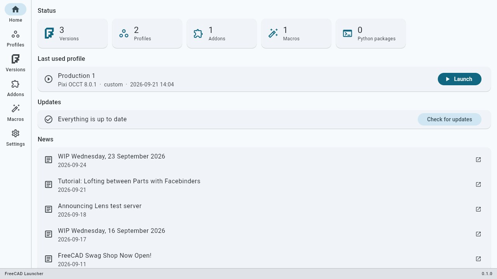
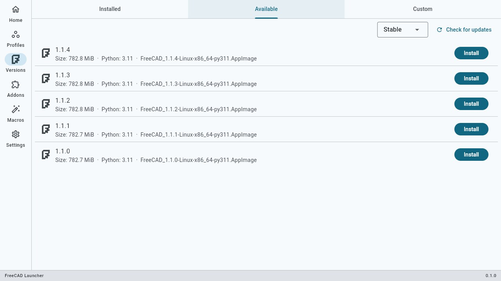
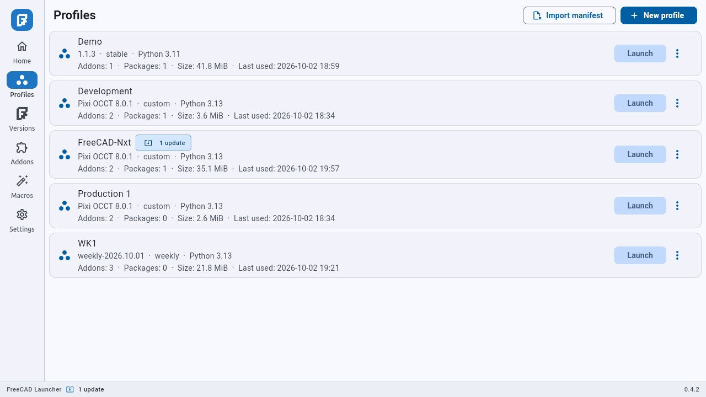
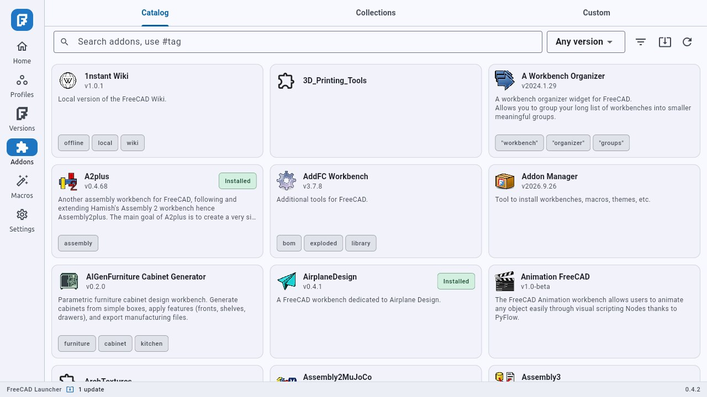
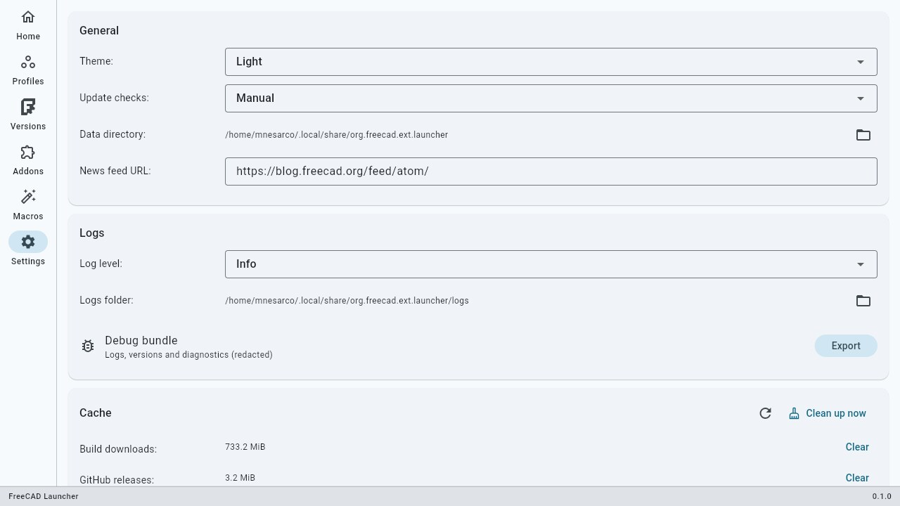

<!-- SPDX-FileCopyrightText: 2026 Frank Martínez <mnesarco at gmail> -->
<!-- SPDX-License-Identifier: GPL-3.0-or-later -->
# FreeCAD Launcher

[](https://github.com/mnesarco/FreeCAD-Launcher/actions/workflows/ci.yml)
[](https://github.com/mnesarco/FreeCAD-Launcher/actions/workflows/appimage-release.yml)

A desktop application that manages multiple FreeCAD builds (versions) side by side and fully
isolated profiles: a single build can back any number of profiles, and each profile gets its own
settings, addons, macros and Python packages.



## Status

- **v0.2 (in progress, Linux-first).** `v0.1.0` is available on the Releases page; the Linux
  AppImage pipeline is productionized and the application is verified on Linux. The Windows
  portable-zip pipeline is in progress (M8-03, D-091); macOS packaging is planned (see
  `docs/spec/08-roadmap.md` and `docs/impl/STATUS.md`).
- Managed catalog builds require **FreeCAD 1.0 or newer**; user-supplied binaries (local files,
  URLs, self-compiled executables) are unconstrained.

## Features

- **Builds** — install stable or weekly development releases from the official FreeCAD release
  catalog (**Stable | Weekly** channel; the latest 52 weeklies, with a confirmation warning for
  development-quality builds), import a local file or URL, or register a self-compiled
  executable in place; verify, relabel and remove.
- **Profiles** — one profile per task/project with isolated `FREECAD_USER_HOME`, `user.cfg` /
  `system.cfg`, `Mod/`, macros, Python target and temporary files. Launch from the app, from the
  Home dashboard, or via the CLI.
- **Addons** — browse/search the official addon catalog (`addons.freecad.org`), install, update
  and remove per profile, pin/freeze versions, or manage reusable collections (bundles) with
  apply, JSON export and import.
- **Python packages** — the build's bundled interpreter installs into the profile only
  (`pip --target`, never the system Python); `requirements.txt` from addons is detected with an
  explicit consent dialog.
- **Macros** — install from the official macro catalog, list, open, reveal and delete per profile.
- **Config** — timestamped `user.cfg`/`system.cfg` snapshots with restore, plus portable
  profile manifest export/import.
- **Updates** — notify-only checks for addon and FreeCAD build updates, tracking stable and
  weekly channels separately (no silent changes).
- **Jobs** — downloads and installs run through a shared queue with progress, cancel, retry and
  per-launch log files.
- **Settings** — theme, update cadence, log level, cache management, CLI wrapper installation,
  diagnostics and a redacted debug bundle export.

| Versions | Profiles | Addons | Settings |
|---|---|---|---|
|  |  |  |  |

## Install

Download the latest artifact from the
[Releases page](https://github.com/mnesarco/FreeCAD-Launcher/releases).

**Linux** — AppImage:

```sh
chmod +x FreeCADLauncher-<version>-x86_64.AppImage
./FreeCADLauncher-<version>-x86_64.AppImage
```

Verify the download with the published checksum, and if your system lacks FUSE, run it with
`APPIMAGE_EXTRACT_AND_RUN=1`.

**Windows** — portable zip (`FreeCADLauncher-<version>-windows-x86_64.zip`): extract it anywhere
and run `freecad_launcher.exe`. The binary is unsigned, so SmartScreen may show a warning
(More info → Run anyway). The zip also contains `7zr.exe` (required to extract the official
FreeCAD `.7z` portable builds), `LICENSE` and `THIRD_PARTY_NOTICES.md`.

Verify the download with the published `.sha256` sidecar (`Get-FileHash -Algorithm SHA256`).

Releases are built by the manually triggered **Release** workflow
(Actions → *Release* → *Run workflow*), which builds both the AppImage and the Windows portable
zip on CI, verifies the checksums, smoke-tests both binaries and optionally publishes a GitHub
Release. Pushing a `vX.Y.Z` tag triggers the same workflow.

Local test builds:

```sh
flutter pub get
dart run build_runner build --delete-conflicting-outputs
ALLOW_PLACEHOLDER_UPDATE_INFO=1 packaging/appimage/build_appimage.sh
```

The script pins and verifies `appimagetool` and the AppImage runtime, and writes
`build/appimage/FreeCADLauncher-<version>-x86_64.AppImage` plus `.sha256` and `.zsync` files.
`ALLOW_PLACEHOLDER_UPDATE_INFO=1` is only needed for local builds without a real repository
identity.

For development, run from source with `flutter run -d linux`.

## Quick start

1. **Install a build** — Versions → *Available* → choose the **Stable | Weekly** channel, then
   **Install**. Use the *Custom* tab to import a local AppImage/archive, a URL, or to register a
   self-compiled FreeCAD executable in place.
2. **Create a profile** — Profiles → **New profile**, pick the build. The profile gets its own
   isolated environment.
3. **Make it yours** — install addons, macros and Python packages into the profile, or restore a
   config snapshot / import a profile manifest.
4. **Launch** — **Launch** on the profile card or Home's last-used card. FreeCAD runs with the
   profile's `user.cfg`/`system.cfg`; per-launch logs are written under the data directory.
5. **Optional CLI** — Settings → *CLI wrapper* installs `freecad-launcher` into `~/.local/bin`
   so profiles can be launched from a shell:

   ```sh
   freecad-launcher list
   freecad-launcher run "My profile" -- --some-freecad-arg
   ```

Full instructions: **[User guide](docs/user-guide.md)**.

## Data, privacy and logs

- Data root (Linux): `~/.local/share/org.freecad.ext.launcher` (shown in Settings → General).
  It contains the database, installed builds, profiles, exports, downloads cache and logs.
- Logs: `<data>/logs/`. Settings → Logs can export a **debug bundle** (redacted logs +
  environment summary, no database) for bug reports.
- Network use: GitHub releases API (builds/updates), `addons.freecad.org` (addon/macro catalogs)
  and the news feed URL configured in Settings. No telemetry; nothing is uploaded.

## Troubleshooting

See the [user guide](docs/user-guide.md#troubleshooting). Common cases:

- **AppImage does not start** — install FUSE (`libfuse2`) or run with
  `APPIMAGE_EXTRACT_AND_RUN=1`.
- **"No versions available"** — check your connection and use *Check for updates*; the cached
  catalog is used offline with a stale-data notice.
- **A build is missing/broken** — the Installed tab shows a badge; use *Verify* to re-check and
  reinstall or relabel as needed.
- **FreeCAD fails to launch** — inspect the per-launch log in the profile's *Running* card and
  the app logs, then attach a debug bundle to any issue.

## License and trademarks

FreeCAD Launcher is licensed under **GPL-3.0-or-later** — see [LICENSE](LICENSE). Third-party
components and their licenses are listed in [THIRD_PARTY_NOTICES.md](THIRD_PARTY_NOTICES.md).

Copyright 2026 Frank Martínez <mnesarco at gmail>.

FreeCAD and the FreeCAD logo are trademarks of the FreeCAD Project Association AISBL. The
launcher bundles the official FreeCAD logo unmodified for attribution only (About dialog);
FreeCAD itself is installed by the user from official sources.

FreeCAD Launcher is an independent, community driven, open source project developed and
maintained by Frank D. Martínez (aka mnesarco).

## Development

```sh
flutter pub get                                            # install deps
dart run build_runner build --delete-conflicting-outputs   # drift codegen
flutter analyze                                            # lint
flutter test                                               # tests
flutter run -d linux                                       # run
dart run tool/generate_third_party_notices.dart            # regenerate notices
```

Documentation map:

- `docs/spec/` — product and technical specification (authoritative).
- `docs/impl/` — implementation plan, task board, decisions and verification (`STATUS.md` is the
  live state).
- `docs/user-guide.md` — end-user guide.
- `addon_index_spec.md` — addon catalog format (upstream data format).

## AI assistance

Development of FreeCAD Launcher is assisted by **DeepSeek 4.1 Flash**. The project is
spec-driven: it is architected, designed and developed by a human with AI assistance — not
vibe-coded.
